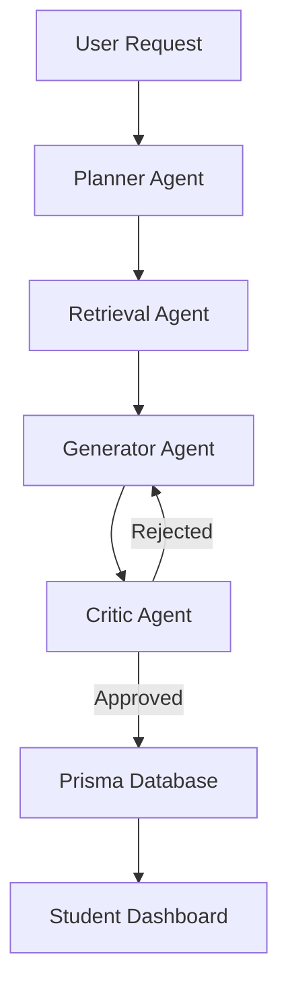

# 🚀 EduTech AI: Autonomous Agentic Learning Platform

[](https://nextjs.org/)
[](https://www.typescriptlang.org/)
[](https://langchain-ai.github.io/langgraphjs/)
[](https://www.prisma.io/)
[](https://clerk.com/)

**EduTech AI** is a state-of-the-art educational platform that leverages **Autonomous AI Agents** to generate dynamic, personalized learning assessments. Built with a multi-agent orchestration layer, it ensures high-quality content generation through a Plan -> Retrieve -> Generate -> Critique cycle.

---

## 🧠 System Architecture

The platform uses a directed acyclic graph (DAG) implemented via **LangGraph** to manage the AI workflow. This ensures that every quiz produced is high-quality, relevant, and verified.



---

## ✨ Key Features

- **Multi-Agent Orchestration**: Separate agents for planning, knowledge retrieval, content generation, and fact-checking.
- **Hybrid AI Strategy**: Seamlessly switches between **Groq (Llama 3)** for speed and **Google (Gemini 1.5 Pro)** for deep reasoning.
- **RAG Integration**: Uses Pinecone vector database for context-aware questions based on educational materials.
- **Secure Authentication**: Enterprise-grade auth with **Clerk**.
- **Modern UI**: A premium, responsive interface built with Tailwind CSS and Framer Motion.

---

## 🛠️ Tech Stack

- **Framework**: [Next.js 15 (App Router)](https://nextjs.org/)
- **Language**: [TypeScript](https://www.typescriptlang.org/)
- **AI Orchestration**: [LangGraph.js](https://langchain-ai.github.io/langgraphjs/) / [LangChain](https://js.langchain.com/)
- **Database**: [PostgreSQL (Neon)](https://neon.tech/) with [Prisma ORM](https://www.prisma.io/)
- **Auth**: [Clerk](https://clerk.com/)
- **Styling**: [Tailwind CSS](https://tailwindcss.com/)
- **Vector DB**: [Pinecone](https://www.pinecone.io/)

---

## 🚀 Getting Started

### 1. Clone the repository
```bash
git clone https://github.com/your-username/edutech-ai.git
cd edutech-ai
```

### 2. Install dependencies
```bash
npm install
```

### 3. Environment Setup
Create a `.env` file in the root directory and fill in the required keys (see [.env.example](.env.example) for reference):
```bash
cp .env.example .env
```

### 4. Database Setup
```bash
npx prisma generate
npx prisma db push
```

### 5. Run the development server
```bash
npm run dev
```

---

## 📦 Deployment

### Deploy to Vercel
1. Push your code to GitHub.
2. Connect your repository to [Vercel](https://vercel.com/).
3. Add all environment variables from `.env` to the Vercel project settings.
4. Set the Build Command: `next build`
5. The deployment will be automatic!

---

## 📄 License
Distributed under the MIT License. See `LICENSE` for more information.

---

**Developed with ❤️ for the future of education.**
